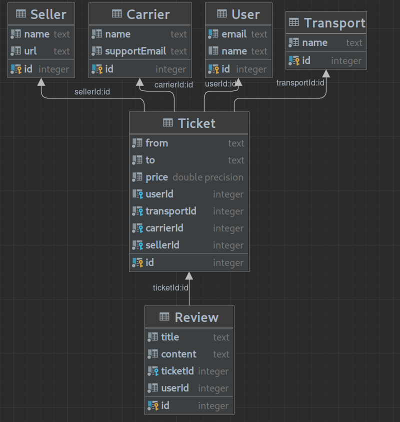

Аникеев Федор М33031 ITMO  
  

### DB info:
Схема представляет собой бекенд для системы учета билетов на транспорт:
- User table has email and id.
- Ticket table has departure and arrival location, price, type of transport, User assigned to ticket, seller and carrier.
- Review table contains title, content, ticketid, userid.
- Seller table contains information about seller, name and url.
- Transport table contains info about means of transport.
- Carrier table contains info about carriers.

